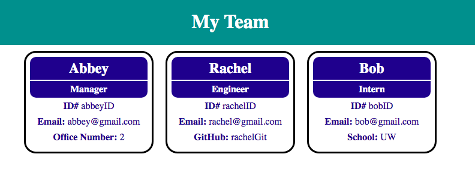

  # Team Profile Generator
  
  ## Description
  
  The goal of this project was to create a team profile generator using node.js. The user will be prompted with a series of questions regarding the team manager and other employees. The inputs will be used to generate and HTML file that summarizes the team.
  
  ## Installation
  
  Instigate the application by entering the following in the command line:

```
node index.js
```
  
  
  ## Demonstration

  Command-line demo:
  
 

 End result:

 
  
  
  ## License
  
[MIT](https://github.com/abbeyschu/TeamProfileGenerator/raw/main/assets/license.txt)
  
